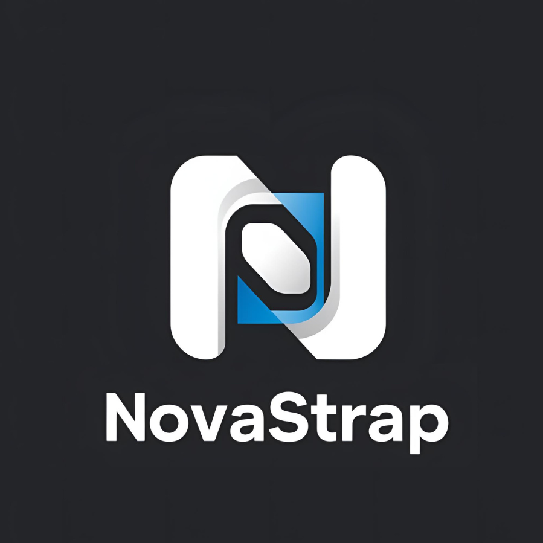

# NovaStrap

<div align="center">



**A modern FFlag editor for Roblox**

Made by **Nova**

[](LICENSE)
[](https://www.microsoft.com/windows)

</div>

---

## 📥 Download

**[Download NovaStrap.exe](dist/NovaStrap.exe)** *(Latest Release)*

Simply download and run - no installation required!

---

## ✨ Features

- 🎨 **Modern Dark UI** - Sleek black and cyan design
- 🔍 **Search FFlags** - Quickly find flags by keyword
- 📝 **JSON Editor** - Edit Roblox FFlags with live validation
- 🚀 **Launch Roblox** - Apply settings and launch the game directly
- 🔐 **Auto Read-Only** - Protects your settings from being overwritten
- 💾 **Backup & Restore** - Automatic timestamped backups
- ⚡ **Lightweight** - Single executable, runs instantly

---

## 🚀 Quick Start

### For Users (Download & Run)

1. **Download** `NovaStrap.exe` from the [releases](dist/NovaStrap.exe)
2. **Run** the executable (no installation needed)
3. **Paste** your FFlags JSON into the editor
4. **Click** "Apply FFlags" to save
5. **Launch** Roblox with the "Launch Roblox" button

### For Developers (Run from Source)

1. **Clone** the repository:
   ```bash
   git clone https://github.com/DebugNova/NovaStrap.git
   cd NovaStrap
   ```

2. **Install** dependencies:
   ```bash
   pip install -r requirements.txt
   ```

3. **Run** the application:
   ```bash
   python main.py
   ```

4. **Build** your own executable:
   ```bash
   python create_icon.py
   pyinstaller NovaStrap.spec
   ```

---

## 📖 Usage

### Applying FFlags

1. Open NovaStrap
2. Paste your FFlags JSON (example format):
   ```json
   {
     "FFlagDebugGraphicsPreferD3D11": "true",
     "DFIntTaskSchedulerTargetFps": "240"
   }
   ```
3. Click **"Validate JSON"** to check for errors
4. Click **"Apply FFlags"** to save
5. Click **"🚀 Launch Roblox"** to start the game

### Searching FFlags

- Use the search bar at the top-right of the editor
- Type keywords like "fps", "vulkan", "sender", etc.
- Press **Enter** or click **"▼ Next"** to navigate matches
- Matches are highlighted in cyan

### Restoring Backups

- Click **"Restore from Backup"** in the menu
- Select a backup file from the list
- Click **"Restore Selected"** to apply

---

## ⚠️ Important Notes

### Safety

✅ **Safe to Use:**
- NovaStrap only modifies local Roblox configuration files
- Does NOT modify game files or executable
- Does NOT inject code or DLLs
- Does NOT interact with Roblox servers
- All changes are fully reversible

⚠️ **What NovaStrap Does:**
1. Creates `%LOCALAPPDATA%\Roblox\ClientSettings\` folder
2. Writes your FFlags to `ClientSettings\IxpSettings.json`
3. Sets the file to read-only (protects from overwrites)

### Disclaimer

- Use FFlags responsibly - some flags may affect performance
- NovaStrap is NOT affiliated with Roblox Corporation
- Use at your own risk - we're not responsible for any issues
- If you encounter problems, simply delete the `ClientSettings` folder

---

## 🛠️ Technical Details

### How It Works

NovaStrap automates the process of creating FFlag configurations:

1. **Path Resolution**: Locates `%LOCALAPPDATA%\Roblox\`
2. **Directory Creation**: Creates `ClientSettings` folder if needed
3. **JSON Writing**: Writes validated JSON to `IxpSettings.json`
4. **File Protection**: Sets read-only attribute
5. **Backup Creation**: Creates timestamped backups automatically

### Tech Stack

- **Python 3.13** - Core language
- **PyQt6** - Modern GUI framework
- **psutil** - Process detection
- **pywin32** - Windows file attributes
- **PyInstaller** - Executable packaging

---

## 📄 License

This project is licensed under the MIT License - see the [LICENSE](LICENSE) file for details.

---

## 🤝 Contributing

Contributions are welcome! Feel free to:

- Report bugs via [Issues](https://github.com/DebugNova/NovaStrap/issues)
- Submit feature requests
- Create pull requests

---

## 💬 Support

If you encounter any issues:

1. Check the **logs** (`novastrap_*.log` in the app directory)
2. Open an [Issue](https://github.com/DebugNova/NovaStrap/issues) on GitHub
3. Include your log file and error description

---

<div align="center">

**Made with ❤️ by Nova**

⭐ Star this repo if you find it useful!

</div>
